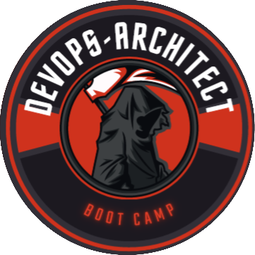
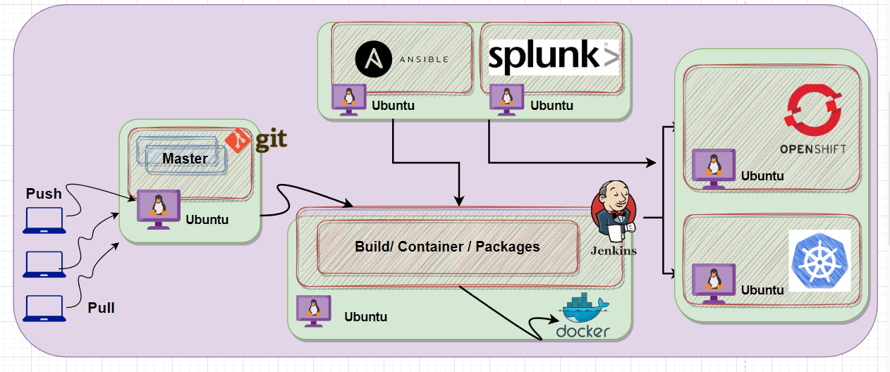

# DevOps-Architect BootCamp 

This repository is used to document all the steps and roadmaps that contribute in the learning "<b> DevOps</b> ". I will be continue this journey till the end of 2023. The reason for documenting these days is so that others can take something from it and also hopefully enhance the resources.

 This will not cover all things "<b>DevOps</b>" but it will cover the areas that I feel will benefit my learning and understanding overall. 

<i>In this journey we will build many projects</i>   

📌 The quickest way to get in touch is going to be via LinkedIn, my handle is @ <a href="https://www.linkedin.com/in bilalmazhar-cyber-security-consultant/">Bilal Mazhar </a>

📅 Learning strategy and calendar can be found here <a href="https://docs.google.com/document/d/1GxTxWSXyEEPv3Q8KJStBb8b5gdyV68lF0qoOpJdG49M/edit?usp=sharing">Learning Plan</a>

[✔️] = Content uploaded  
[🚧] = In - Progress 
[✖️] = Not Started 

# Prerequisite for DevOps   
DevOps is a methodology that focuses on collaboration and communication between software development teams and IT operations teams to streamline software delivery and improve efficiency. To become a DevOps practitioner, you need to have a solid foundation in several areas, including:   
1. Software Development   
2. System Administration  
3. Automation  
4. Cloud Computing  
5. Collaboration and Communication  
6. Continuous Integration and Continuous Deployment 
7. Containers and Oreshtration

[✔️] ♾️ 1 :   <a href="https://github.com/BilalMaz/DevOps-Architect_Notes/blob/main/Introduction_DevOps.pdf">Introudction to DevOps</a>   
[✔️] 🐧 2  :  <a href="https://github.com/BilalMaz/DevOps-Architect-BootCamp/blob/main/Linux%20-%20CrashCourse.pdf">Intruduction to Linux</a>  
[✔️] 💥 3  :  <a href="https://github.com/BilalMaz/DevOps-Architect-BootCamp/blob/main/Introduction%20to%20Scripting.pdf">Introudction to Scripting Language</a>  
[🚧] 🐍 4  :  <a href="https://github.com/BilalMaz/DevOps-Architect-BootCamp/blob/main/Python%20-%20Up%20and%20Running.pdf">Introudction to Python Programming </a> 
[✖️] 🐹 5  :  <a href="#">Introudction to Go Programming </a> 
[✖️] ☁️ 6  :  <a href="#">Introudction to the Cloud </a>  
[✖️] ♾️ 6  :  <a href="#">Day in life of DevOps Engineer </a> 

# Resources 
[✖️] 📚 1  :  <a href="#">DevOps Books</a> 
[✔️] 📚 2  :  <a href="https://github.com/BilalMaz/DevOps-Architect-BootCamp/tree/main/Scripts/Bash">Bash Practics Scripts</a> 
[🚧] 📚 1  :  <a href="https://github.com/BilalMaz/DevOps-Architect-BootCamp/tree/main/Scripts/Python">Python Practics Scripts</a> 

# Labs Setup  

Hands-on experience is essential to learning DevOps, as it provides an opportunity to apply theoretical knowledge in a practical setting, and to gain a deeper understanding of how DevOps tools and practices work in the real world.

Some key reasons why hands-on experience is important in learning DevOps include:

    1.Learning by doing: Hands-on experience allows you to actively engage with DevOps tools and practices, and to learn through trial and error. This can help to reinforce theoretical concepts, and to develop a more intuitive understanding of how things work.
    2.Building practical skills: By working with DevOps tools and practices in a real-world setting, you can develop practical skills that are directly applicable to your work as a DevOps professional.
    3.Gaining confidence: Hands-on experience can help to build confidence in your ability to work with DevOps tools and practices, and to tackle complex problems in a production environment.
    4.Improving problem-solving skills: By working through real-world problems and challenges, you can develop your problem-solving skills and learn how to troubleshoot issues in a production environment.
    5.Developing a portfolio: Hands-on experience can help you build a portfolio of work that demonstrates your skills and experience to potential employers or clients.

[✖️] 🔬 1  :  <a href="#">Tools of DevOps</a> 
[✖️] 🔬 2  :  <a href="#">Vmware || VituaBox isntallations</a>  
[✖️] 🔬 3  :  <a href="#">Linux</a>  
[✖️] 🔬 4  :  <a href="#">Python || Go IDE's Installations</a>  
[✖️] 🔬 5  :  <a href="#">Git</a>  
[✖️] 🔬 5  :  <a href="#">Github</a>  
[✖️] 🔬 6  :  <a href="#">Jenskins</a>  
[✖️] 🔬 7  :  <a href="#">Ansible</a> 
[✖️] 🔬 7  :  <a href="#">Docker</a> 
[✖️] 🔬 8  :  <a href="#">Kubernetes</a> 
[✖️] 🔬 9  :  <a href="#">Openeshift</a> 
[✖️] 🔬 10 :  <a href="#">OpenStack</a> 
[✖️] 🔬 11 :  <a href="#">Terrafrom </a> 
[✖️] 🔬 12 :  <a href="#">AWS Account - Setup</a> 
[✖️] 🔬 12 :  <a href="#">Networking Lab - setup</a> 
[✖️] 🔬 13 :  <a href="#">Azure Account - Setup</a> 
[✖️] 🔬 14 :  <a href="#">Google cloud Account - Setup</a> 
[✖️] 🔬 15 :  <a href="#">PowerBI</a> 
[✖️] 🔬 16 :  <a href="#">ELK</a> 
[✖️] 🔬 17 :  <a href="#">Tablue</a> 

# Linux Administration  

 Linux administration is the process of managing and maintaining a Linux-based operating system (OS). It involves configuring and managing various aspects of the system, such as hardware, software, and network components, to ensure that the system runs smoothly and efficiently.

Some common tasks involved in Linux administration include:

    1. Installing and configuring the operating system and software packages
    2. Managing users and groups, including setting permissions and access controls
    3. Managing file systems, including creating and managing partitions, directories, and files
    4. Managing network configurations, including configuring network interfaces, DNS, and routing
    5. Monitoring system performance, including tracking resource utilization and identifying and resolving bottlenecks
    6. Managing backups and disaster recovery processes
    7. Configuring and managing security features, including firewalls, intrusion detection and prevention, and access controls.

[✖️] 👨 1  :  <a href="#">what is System administrationn ?</a> 
[✖️] 📝 2  :  <a href="#">What are the tasks of Systems administration?</a> 
[✖️] 🛡️ 3  :  <a href="#">Day in life of Systems administrator</a> 

# Networking Fundamentals 

Networking fundamentals refer to the basic concepts, principles, and technologies that underlie computer networking. Here are some key networking fundamentals:

    1. Network architecture: This refers to the design and layout of a computer network. It includes the physical components (such as servers, switches, routers, and cables) as well as the logical components (such as protocols and services) that define how the network functions.
    2. Protocols: These are rules and standards that govern how data is transmitted over a network. Examples of common protocols include  TCP/IP, HTTP, and SMTP.
    3. Network topologies: These refer to the physical layout of a network. Examples of network topologies include star, bus, and mesh.
    4. Network addressing: This involves assigning unique addresses to each device on the network, which enables them to communicate with each other. Common network addressing schemes include IP addressing and MAC addressing.
    5. Routing: This refers to the process of directing data packets between different networks. Routers are used to perform this function.
    6. Network security: This involves implementing measures to protect a network from unauthorized access, data breaches, and other security threats. Examples of network security measures include firewalls, VPNs, and encryption.
    7. Wireless networking: This involves the use of wireless technologies to connect devices to a network. Examples of wireless networking technologies include Wi-Fi, Bluetooth, and cellular networks

[✖️] 🌍 1  :  <a href="#">Introudction to Networking</a> 
[✖️] 🌍 2  :  <a href="#">OSI Model - 7 Layers of network</a> 
[✖️] 🌍 3  :  <a href="#">Network Protocols</a> 
[✖️] 🌍 4  :  <a href="#">Introduction to GNS3</a> 

# Version Control 

Version control is a system that enables you to manage changes to a file or set of files over time. It is commonly used in software development to track changes to source code, but it can also be used for other types of files such as documents, images, and configuration files.

[✖️] 🔙 1  :  <a href="#">Introduction to Version Control</a> 
[✖️] 🐙 2  :  <a href="#">Git</a> 
[✖️] 🐱 3  :  <a href="#">Github</a> 
[✖️] 🦊 4  :  <a href="#">GitLab</a> 

# Continuous integration and Continuous deployment

Continuous Integration (CI) and Continuous Deployment (CD) are two related concepts in software development that aim to streamline the process of building, testing, and deploying software.

      1. Continuous Integration (CI) is the practice of frequently merging code changes from multiple developers into a shared code repository. Each code change is automatically built and tested to detect integration errors early and prevent issues from being introduced into the codebase.
      2. Continuous Deployment (CD) is the practice of automatically deploying changes to the production environment after they have been built and tested in a staging or testing environment. This ensures that new features and bug fixes are delivered to users quickly and reliably.

[✖️] 🗃️ 1  :  <a href="#">Introduction to CI / CD</a> 
[✖️] 🗃️ 2  :  <a href="#">Jenkins</a> 
[✖️] 🗃️ 3  :  <a href="#">GitLab CI/CD</a> 
[✖️] 🗃️ 4  :  <a href="#">CircleCI</a> 

# Programming

[✖️] 🗃️ 1  :  <a href="#">Python</a> 
[✖️] 🗃️ 3  :  <a href="#">Python - Django</a> 
[✖️] 🗃️ 5  :  <a href="#">Java</a> 
[✖️] 🗃️ 7  :  <a href="#">Java Web Programming</a> 
[✖️] 🗃️ 9  :  <a href="#">Go</a> 

# Containers 

A container is a lightweight, portable unit of software that encapsulates an application and its dependencies, allowing it to run consistently across different environments. Containers are an important technology for modern software development and deployment, particularly in the context of cloud computing and microservices architecture.

     1.Portability: Containers can run on any platform that supports containerization, providing a consistent environment for applications regardless of the underlying infrastructure.
     2.Scalability: Containers can be easily replicated and deployed across multiple hosts, making it easy to scale applications up or down based on demand.
     3.Efficiency: Containers are lightweight and can be started and stopped quickly, making them an efficient way to manage resources and reduce costs.
     4.Consistency: Containers provide a consistent runtime environment for applications, reducing the likelihood of configuration errors and compatibility issues.

[✖️] 🗃️ 1  :  <a href="#">Introduction to Containers</a> 
[✖️] 🗃️ 2  :  <a href="#">Docker</a> 

# Kubernetes 
Kubernetes, also known as K8s, is an open-source container orchestration platform that automates the deployment, scaling, and management of containerized applications. It was originally developed by Google and is now maintained by the Cloud Native Computing Foundation (CNCF).

     1.Container orchestration: Kubernetes automates the deployment, scaling, and management of containerized applications, making it easy to manage large and complex deployments.
     2.Self-healing: Kubernetes can automatically detect and recover from failures in the system, ensuring that applications are always available.
     3.Load balancing: Kubernetes provides built-in load balancing for containerized applications, distributing traffic across multiple instances of an application.
     4.Scalability: Kubernetes enables applications to scale up or down based on demand, automatically provisioning or decommissioning resources as needed.
     5.ollouts and rollbacks: Kubernetes provides a way to manage updates and changes to applications, allowing for rollouts and rollbacks of new versions without disrupting service.

[✖️] 🗃️ 1  :  <a href="#">Introduction to Orchestration</a> 
[✖️] 🗃️ 2  :  <a href="#">Kubernetes</a> 

# Learn Infrastructure as Code
Infrastructure as Code (IaC) is a practice of defining and managing IT infrastructure using code, just like software applications. It involves using declarative or imperative code to automate the provisioning, configuration, and management of infrastructure resources such as servers, networks, storage, and applications.

[✖️] 🗃️ 1  :  <a href="#">Introduction to IaC</a> 
[✔️] 🗃️ 2  :  <a href="https://github.com/BilalMaz/DevOps-Architect-BootCamp/blob/main/Ansible%20Up%20and%20Running.pdf">Ansible</a> 
[✖️] 🗃️ 3  :  <a href="#">Terraform</a> 

# Cloud  
In the context of computing, "cloud" generally refers to a network of remote servers that are used to store, manage, and process data and applications, rather than using a local server or personal computer. Cloud computing allows users to access computing resources, such as processing power, storage, and networking, over the internet on an on-demand basis, without the need for physical hardware or infrastructure.

[✖️] 🗃️ 1  :  <a href="#">Introduction to Cloud</a> 
[✖️] 🗃️ 2  :  <a href="#">AWS Certified Cloud Practitioner</a> 
[✖️] 🗃️ 3  :  <a href="#">Microsoft Certified: Azure Fundamentals</a> 
[✖️] 🗃️ 4  :  <a href="#">Google Associate Cloud Engineer</a> 

# Cloud DevOps 
Cloud DevOps refers to the practice of applying DevOps principles and practices to cloud-based infrastructure and applications. This involves using cloud-based services and tools to build, deploy, and manage applications, while also leveraging DevOps practices such as continuous integration and delivery, automation, and monitoring.

[✖️] 🗃️ 1  :  <a href="#">Introduction to Cloud DevOps</a> 
[✖️] 🗃️ 2  :  <a href="#">AWS Certified DevOps Engineer </a> 
[✖️] 🗃️ 3  :  <a href="#">Microsoft Certified: DevOps Engineer Expert</a> 
[✖️] 🗃️ 4  :  <a href="#">Google Professional Cloud DevOps Engineer</a> 

# Monitoring, Log Management, and Data Visualisation
Monitoring is an essential aspect of DevOps, as it enables teams to quickly detect and respond to issues in production environments. Monitoring involves collecting, analyzing, and visualizing data from applications and infrastructure, in order to identify trends, anomalies, and performance issues that may impact the user experience.

[✖️] 🗃️ 1  :  <a href="#">Introduction to Monitoring , Logs and Virtualization</a> 
[✖️] 🗃️ 2  :  <a href="#">Splunk</a> 
[✖️] 🗃️ 3  :  <a href="#">PowerBI</a> 
[✖️] 🗃️ 4  :  <a href="#">Tablue</a> 
[✖️] 🗃️ 5  :  <a href="#">ELK</a> 

# License

[✔️] <a href="https://creativecommons.org/licenses/by-nc-sa/4.0/">CC licensing</a> 

[✔️] <a href="https://forms.gle/amZaPeuDkcAaPXhd6">Feedback<a> 

