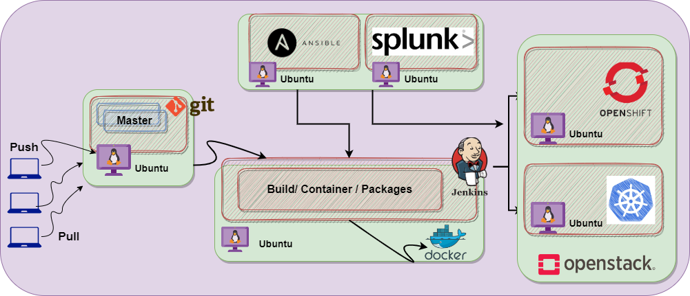

# DevOps-Architect BootCamp 

This repository is used to document all the steps and roadmaps that contribute in the learning "<b> DevOps</b> ". I will be continue this journey till the end of 2023. The reason for documenting these days is so that others can take something from it and also hopefully enhance the resources.

 This will not cover all things "DevOps" but it will cover the areas that I feel will benefit my learning and understanding overall. 

<i>In this journey we will build many projects</i>   

The quickest way to get in touch is going to be via LinkedIn, my handle is @ <a href="https://www.linkedin.com/in bilalmazhar-cyber-security-consultant/">Bilal Mazhar </a>

Learning stratgy and calendar can be found here <a href="#">Calendar</a>

# Prerequisite for DevOps   
DevOps is a methodology that focuses on collaboration and communication between software development teams and IT operations teams to streamline software delivery and improve efficiency. To become a DevOps practitioner, you need to have a solid foundation in several areas, including:   
1. Software Development   
2. System Administration  
3. Automation  
4. Cloud Computing  
5. Collaboration and Communication  
6. Continuous Integration and Continuous Deployment 
7. Containers and Oreshtration

[✔️] ♾️ 1 :   <a href="https://github.com/BilalMaz/DevOps-Architect_Notes/blob/main/Introduction_DevOps.pdf">Introudction to DevOps</a>   
[✔️] 🧠2  :  <a href="https://github.com/BilalMaz/DevOps-Architect_Notes/blob/main/Introduction_DevOps.pdf">Intruduction to Linux</a>  
[✔️] ⌨️ 3  :  <a href="#">Introudction to Scripting Language</a>  
[✔️] ⌨️ 4  :  <a href="#">Introudction to Python Prograaming </a> 
[✔️] ⌨️ 5  :  <a href="#">Introudction to Go prgramming </a> 
[✔️] ☁️ 6  :  <a href="#">Introudction to the Cloud </a>  
[✔️] ☁️ 6  :  <a href="#">Day in life of DevOps Engineer </a> 

# Labs Setup  

It is important to learn through hands On approach , so we going to set up our labs on below mentioned tools

[✔️] 🗃️ 1  :  <a href="#">Tools of DevOps</a> 
[✔️] 🗃️ 2  :  <a href="#">Vmware || VituaBox isntallations</a>  
[✔️] 🗃️ 3  :  <a href="#">Linux</a>  
[✔️] 🗃️ 4  :  <a href="#">Python || Go IDE's Installations</a>  
[✔️] 🗃️ 5  :  <a href="#">Git</a>  
[✔️] 🗃️ 5  :  <a href="#">Github</a>  
[✔️] 🗃️ 6  :  <a href="#">Jenskins</a>  
[✔️] 🗃️ 7  :  <a href="#">Ansible</a> 
[✔️] 🗃️ 7  :  <a href="#">Docker</a> 
[✔️] 🗃️ 8  :  <a href="#">Kubernetes</a> 
[✔️] 🗃️ 9  :  <a href="#">Openeshift</a> 
[✔️] 🗃️ 10 :  <a href="#">OpenStack</a> 
[✔️] 🗃️ 11 :  <a href="#">Terrafrom </a> 
[✔️] 🗃️ 12 :  <a href="#">AWS Account - Setup</a> 
[✔️] 🗃️ 12 :  <a href="#">Networking Lab - setup</a> 
[✔️] 🗃️ 13 :  <a href="#">Azure Account - Setup</a> 
[✔️] 🗃️ 14 :  <a href="#">Google cloud Account - Setup</a> 
[✔️] 🗃️ 15 :  <a href="#">PowerBI</a> 
[✔️] 🗃️ 15 :  <a href="#">ELK</a> 
[✔️] 🗃️ 15 :  <a href="#">Tablue</a> 

# Linux Administration  

[ Please fin the introduction Services] 

[✔️] 🗃️ 1  :  <a href="#">what is System Adminsitration ?</a> 
[✔️] 🗃️ 2  :  <a href="#">What are the tasks of Systems Adminstration?</a> 
[✔️] 🗃️ 3  :  <a href="#">Day in life of Systems Administration</a> 

# Networking Fundamentals 

[ Please fin the introduction Services]

[✔️] 🗃️ 1  :  <a href="#">Introudction to Networking</a> 
[✔️] 🗃️ 2  :  <a href="#">OSI Model - 7 Layers of network</a> 
[✔️] 🗃️ 3  :  <a href="#">Network Protocols</a> 
[✔️] 🗃️ 4  :  <a href="#">Introduction to GNS3</a> 

# Version Control 

[ Please fin the introduction Services]

[✔️] 🗃️ 1  :  <a href="#">Introduction to Version Control</a> 
[✔️] 🗃️ 2  :  <a href="#">Git</a> 
[✔️] 🗃️ 3  :  <a href="#">Github</a> 
[✔️] 🗃️ 4  :  <a href="#">GitLab</a> 

# Continuous integration and Continuous deployment

[ Please fin the introduction Services]

[✔️] 🗃️ 1  :  <a href="#">Introduction to CI / CD</a> 
[✔️] 🗃️ 2  :  <a href="#">Jenkins</a> 
[✔️] 🗃️ 3  :  <a href="#">GitLab CI/CD</a> 
[✔️] 🗃️ 4  :  <a href="#">CircleCI</a> 

# Containers 
[✔️] 🗃️ 1  :  <a href="#">Introduction to Containers</a> 
[✔️] 🗃️ 2  :  <a href="#">Docker</a> 
[✔️] 🗃️ 3  :  <a href="#">Dokcer Projects</a> 

# Kuberntes  
[✔️] 🗃️ 1  :  <a href="#">Introduction to Orchestration</a> 
[✔️] 🗃️ 2  :  <a href="#">Kubernetes</a> 
[✔️] 🗃️ 3  :  <a href="#">Kubernetes Projects</a> 

# Learn Infrastructure as Code
[✔️] 🗃️ 1  :  <a href="#">Introduction to IaC</a> 
[✔️] 🗃️ 2  :  <a href="https://github.com/BilalMaz/DevOps-Architect-BootCamp/blob/main/Ansible%20Up%20and%20Running.pdf">Ansible</a> 
[✔️] 🗃️ 3  :  <a href="#">Terraform</a> 

# Cloud  
[✔️] 🗃️ 1  :  <a href="#">Introduction to Cloud</a> 
[✔️] 🗃️ 2  :  <a href="#">AWS Certified Cloud Practitioner</a> 
[✔️] 🗃️ 3  :  <a href="#">Microsoft Certified: Azure Fundamentals</a> 
[✔️] 🗃️ 4  :  <a href="#">Google Associate Cloud Engineer</a> 

# Monitoring, Log Management, and Data Visualisation
[✔️] 🗃️ 1  :  <a href="#">Introduction to Monitoring , Logs and Virtualization</a> 
[✔️] 🗃️ 2  :  <a href="#">Splunk</a> 
[✔️] 🗃️ 3  :  <a href="#">PowerBI</a> 
[✔️] 🗃️ 4  :  <a href="#">Tablue</a> 
[✔️] 🗃️ 5  :  <a href="#">ELK</a> 

# License

[✔️] <a href="https://creativecommons.org/licenses/by-nc-sa/4.0/">CC licensing</a> 

[✔️] <a href="https://forms.gle/amZaPeuDkcAaPXhd6">Feedback<a> 

